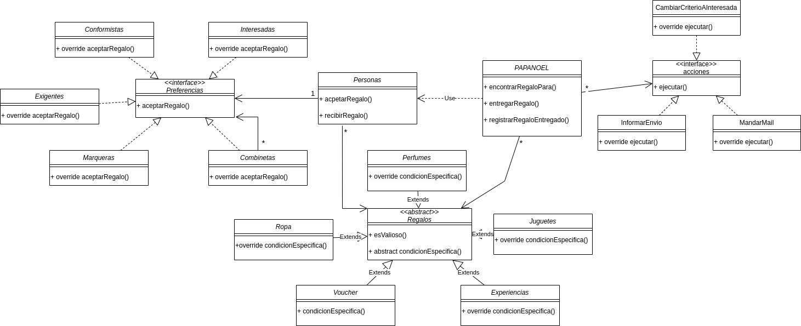
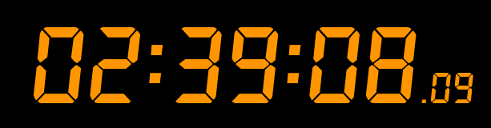

# Enunciado:

https://docs.google.com/document/d/1hswq2ZZCRL-SWZNavJ3oW93JwBYxcBUfBbgTsgipPvY/edit#heading=h.ntq02oajeche

# Diagrama de flujo:

https://drive.google.com/file/d/1uZFBEiTKBA_1g0_y4YuTc0R7j_L1OxEV/view?usp=sharing

# Explicaicon de diseño:

## Patrones encontrados:

- estrategy (class Persona)
- Composite (interface Preferenicas)
- template Method (abstract class Regalos)
- Observer (Acciones)

# Timepo completo de desarrollo

